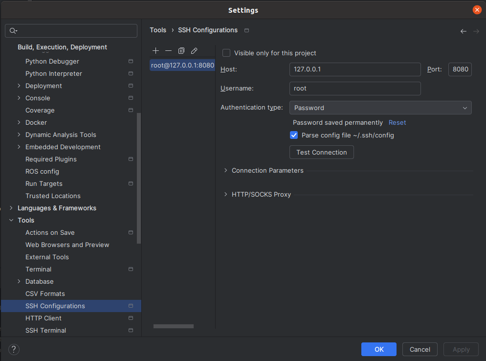
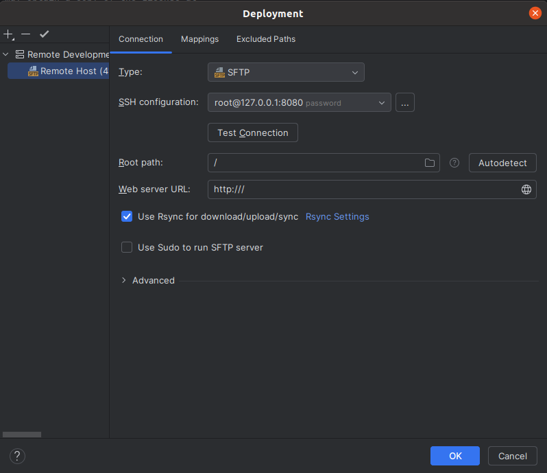
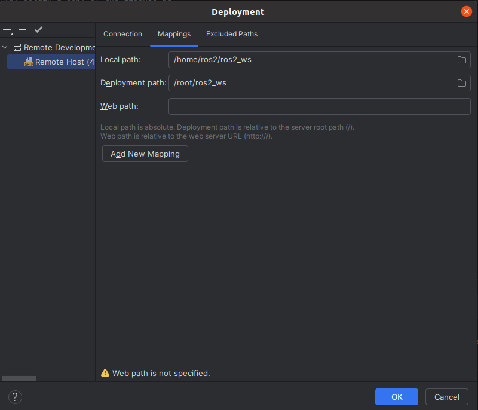

## docker配置、使用

1. 安装docker

2. 拉取ros2镜像

   - 需要先配置docker的代理（网上有、或者小鱼）

   - 拉取镜像（或者小鱼）

     ```
     docker pull osrf/ros:humble-desktop
     ```

3. 通过镜像创建容器

   - ```bash
      docker create ... # 只创建不运行
      ```

   - ```bash
      sudo docker run -dit --name humble2 --privileged -v /home/ros2:/home/ros2 -v /tmp/.X11-unix:/tmp/.X11-unix -v /dev:/dev -v /dev/dri:/dev/dri -p 8080:80 -e DISPLAY=unix$DISPLAY 镜像名字(fishros2/ros:humble-desktop-full) # 创建并运行
      ```

4. 查看容器

   - ```bash
      # 查看运行中容器
      sudo docker ps 
      # 查看所有容器
      sudo docker ps -a
      ```
   
5. 启动容器（当容器停止时）

   - ```bash
      sudo docker start ID
      ```

6. 进入容器

   - ```bash
      #attach（推出后容器会被删除，不建议使用）
      sudo docker attach ID
      
      #exec（退出后容器会保留）
      sudo docker exec -it ID bash
      ```

7. 添加容器挂载目录

   - 停止docker服务、停止运行docker容器

      ```bash
      sudo docker stop ID
      sudo systemctl stop docker
      ```

      

   - ```bash
      cd /var/lib/docker/containers
      cd （属于该容器的目录，根据id找）
      ```

   - 修改config.v2.json

      ```json
      "/path": {
                  "Source": "/path",
                  "Destination": "/path",
                  "Driver": "",
                  "Name": "",
                  "Propagation": "rprivate",
                  "RW": true,
                  "Relabel": "ro",
                  "SkipMountpointCreation": false,
                  "Spec": {
                      "Source": "/path",
                      "Target": "/taeget_path",
                      "Type": "bind"
                  },
                  "Type": "bind"
      }
      ```

   - 修改hostconfig.json，在Binds中添加

      ```json
      "Binds": [
              "/path:/target_path"
      ]
      ```

8. 查看容器端口号

   ```
   sudo docker port ID
   ```

9. 一些概念

   - docker 相当一个小虚拟机，需要使用镜像实例化出一个容器，每个容器都是独立的环境，这个环境根据镜像创建出来


## clion + docker开发

### 1. docker配置ssh

1. 安装ssh

   ```bash
   apt-get update 
   apt-get install openssh-client
   apt-get install openssh-server
   ```

   

2. docker中启动、配置SSH

   - 启动ssh

     ```
     ./etc/init.d/ssh start 
     ```

   - 修改配置文件/etc/ssh/sshd_config 允许root用户登陆

     ```bash
     # 添加以下内容
     UsePAM no
     PermitRootLogin yes
     PasswordAuthentication yes
     
     #修改Port
     Port=映射设置的docker中的端口
     ```

   - 重启ssh

     ```bash
     service ssh restart
     systemctl enable ssh
     ```

   - 设置docker中root用户密码 

     ```bash
     passwd root
     ```

   - 设置ssh随docker启动

     ```bash
     touch /root/start_ssh.sh  
     vim /root/start_ssh.sh chmod +x /root/start_ssh.sh
     ```

     添加以下内容

     ```bash
     #!/bin/bash   
     
     LOGTIME=$(date "+%Y-%m-%d %H:%M:%S") 
     echo "[$LOGTIME] startup run..." >>/root/start_ssh.log 
     service ssh start >>/root/start_ssh.log   ###其他服务也可这么实现
     ```

     将脚本添加到启动文件

     ```
     vim /root/.bashrc
     ```

     在.bashrc文件末尾插入

     ```
     if [ -f /root/start_ssh.sh ]; then       
         . /root/start_ssh.sh 
     fi
     ```

     ```
     source /root/.bashrc
     ```

     

## 2. clion配置

1. **setting** ->ssh configuration

   

2. 配置ssh deployment

   

   

3. 配置tool chains

   > 

4. 配置cmake

   

   - Toolchain选择刚才配置的toolchain

   - Environment设置

     ```bash
     # 在docker内的终端输入
     
     ros_env="AMENT_PREFIX_PATH CMAKE_PREFIX_PATH COLCON_PREFIX_PATH PKG_CONFIG_PATH PYTHONPATH LD_LIBRARY_PATH PATH ROS_DISTRO ROS_PYTHON_VERSION ROS_LOCALHOST_ONLY ROS_VERSION"
     env_string=""
     for e in ${ros_env}; do
         env_string+="$e=${!e};"
     done
     echo "$env_string"
     
     # 将打印出路径填到Environment中
     ```

5. 这样就实现了本地的代码，使用docker中的环境编译

## docker中一些额外的配置

1. 命令行补全

   - 安装bash-completion

     ```bash
     apt install bash-completion
     ```

   - 开启

     ```bash
     # vi /etc/bash.bashrc
     
     # enable bash completion in interactive shells
     if ! shopt -oq posix; then
      if [ -f /usr/share/bash-completion/bash_completion ]; then
        . /usr/share/bash-completion/bash_completion
      elif [ -f /etc/bash_completion ]; then
        . /etc/bash_completion
      fi
     fi
     ```

   - 如仍然无法补全包名

     ```bash
     cd /etc/apt/apt.conf.d
     rm docker-clean
     apt update
     ```

2. 图形化界面

   1. docker内

      1. 安装依赖

      ```
      sudo apt-get update
      sudo apt-get install -y libx11-xcb1 libxcb1 libx11-dev libx11-xcb-dev libxcb-glx0 libxcb-shm0 libxcb-util1 libxcb-keysyms1 libxcb-image0 libxcb-randr0 libxcb-render0 libxcb-render-util0 libxcb-xkb1 libxkbcommon-x11-0
      ```

      2. 上面创建容器时映射了X11，则安装

      ```bash
      sudo apt-get install -y xauth
      sudo apt-get install -y mesa-utils
      ```

   2. 主机

      ```bash
      sudo apt-get install x11-xserver-utils
      
      # 允许所有用户，包括docker，访问X11 的显示接口
      # 每次重启电脑后都要重新输入一次这个命令，否则无法打开图形界面
      xhost +
      #输出为：access control disabled, clients can connect from any host
      
      ```
      
      
   
   

